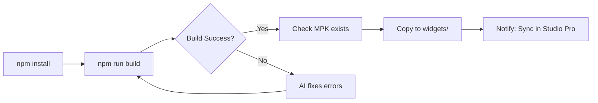

# Widget Creation Agent - Design Specification

**Version**: 2.1 (Enhanced with Two-Path Approach + Icon Guidance)  
**Last Updated**: December 17, 2025  
**Status**: ✅ All patterns tested and working in Mendix Studio Pro 11.5.0

## Overview

An AI-powered agent that guides developers through creating Mendix pluggable widgets from concept to deployment, without requiring manual terminal interactions or deep Mendix knowledge.

## Vision Statement

> "Tell me what you want to build, I'll handle the rest."

## 🎯 TWO APPROACHES - User Chooses Their Path

### Approach 1: Full Interview (Start from Scratch)

**Use when:** User has an idea but no code yet

1. Discovery interview - understand what they want
2. Design proposal - AI suggests widget structure
3. Clarifying questions - icons, styling, features
4. Generate complete widget from scratch
5. Build, test, iterate

### Approach 2: TSX Conversion (Existing Component)

**Use when:** User has working React/TSX component to adapt

1. User provides existing TSX code
2. AI analyzes props, state, events
3. Map React patterns to Mendix patterns
4. Generate XML property definitions
5. Adapt component, build, deploy

**Agent should ask early:** "Are you starting from scratch, or do you have existing React/TSX code to convert?"

## ⚠️ CRITICAL: Verified Configuration (Battle-Tested)

These settings have been **tested and confirmed working** through actual builds:

```json
// tsconfig.json - MUST EXTEND BASE (explicit jsx causes Rollup errors!)
{
  "extends": "@mendix/pluggable-widgets-tools/configs/tsconfig.base",
  "compilerOptions": {
    "baseUrl": "./"
  },
  "include": ["./src", "./typings"]
}
```

```json
// package.json dependencies - TESTED WORKING
{
  "devDependencies": {
    "@mendix/pluggable-widgets-tools": "^10.18.0",
    "cross-env": "^7.0.3"
  },
  "overrides": {
    "react": "18.2.0",
    "react-dom": "18.2.0",
    "@types/react": "~18.2.0",
    "@types/react-dom": "~18.2.0"
  }
}
```

## 🚨 CRITICAL GOTCHAS (From Real Build Errors)

### 1. Must Import createElement

When extending tsconfig.base:

```tsx
// ✅ REQUIRED
import { createElement, ReactNode } from 'react';
```

### 2. Props Use `class` NOT `className`

```tsx
// ❌ WRONG - TypeScript error
<div className={props.className}>

// ✅ CORRECT - Mendix convention
<div className={`widget-name ${props.class}`}>
```

### 3. Must Include Class/Style System Properties

```xml
<propertyGroup caption="Common">
    <systemProperty key="Name"/>
    <systemProperty key="Class"/>    <!-- Required for props.class -->
    <systemProperty key="Style"/>    <!-- Required for props.style -->
    <systemProperty key="TabIndex"/>
    <systemProperty key="Visibility"/>
</propertyGroup>
```

### 4. Unused Variables Fail Build

```tsx
// ❌ Build fails
const handleBlur = useCallback((e: FocusEvent) => {

// ✅ Prefix with underscore
const handleBlur = useCallback((_e: FocusEvent) => {
```

## 🎯 Toolbox Category Placement

Widgets appear in specific Studio Pro toolbox sections based on `<studioProCategory>`:

| Value                | Toolbox Section                  |
| -------------------- | -------------------------------- |
| `Display`            | Display widgets (labels, badges) |
| `Input`              | Input elements (buttons, text)   |
| `Structure`          | Containers and layouts           |
| `Menus & navigation` | Navigation components            |
| `Data controls`      | Lists and grids                  |
| _(omitted)_          | Add-ons (bottom, no icon)        |

**ALWAYS include `<studioProCategory>` to avoid Add-ons placement!**

## Workflow Phases

### Phase 1: Discovery Interview

**Start with the key path question:**

> "Are you starting from scratch, or do you have existing React/TSX code to convert?"

**If starting from scratch, AI asks:**

1. "What problem are you trying to solve with this widget?"
2. "Describe the user interaction - what will users see and do?"
3. "What data does this widget need to work with?"
   - Entity attributes?
   - List of objects?
   - Static configuration?
4. "Should users be able to edit data, or is this display-only?"
5. "What should happen when users interact? (click, change, etc.)"
6. **🎨 "Do you have a custom icon? (64x64 PNG recommended) I'll use it for both the toolbox and page preview."**

**If converting TSX, AI asks:**

1. "Please share the TSX code you want to convert"
2. "What does this component do in your current app?"
3. "What props does the parent component pass to it?"
4. **🎨 "Do you have a custom icon? (64x64 PNG recommended)"**

**AI interprets into:**

- Required property types (expression, textTemplate, attribute, datasource, action, enumeration)
- Widget complexity tier (Simple Display → Input → Container → List-based)
- Potential NPM packages needed
- Similar existing Mendix widgets to reference

### Phase 2: Clarification & Design

**AI presents:**

```
Based on your description, I recommend:

📦 Widget: StatusBadge
📂 Category: Display
🏗️ Complexity: Simple

Properties:
- statusText (textTemplate) - What to display
- statusType (enumeration) - success/warning/error/info
- onClick (action) - Optional click handler

This is similar to the official Mendix Badge widget.
Would you like to proceed, or adjust the design?
```

**Clarifying questions if needed:**

- "Do you need multiple sizes or just one?"
- "Should the color be configurable or automatic based on type?"
- "Do you need an icon alongside the text?"

### Phase 3: Environment Setup

**AI asks:**

1. "Where should I create the widget project?"
   - Default suggestion: `D:\kelly.seale\CodeBase\PluggableWidgets\[WidgetName]`
2. "Which Mendix project for testing?"
   - Default: `D:\kelly.seale\CodeBase\SmartHub-main_ForTesting\SmartHub.mpr`
   - Or custom path

**AI sets up:**

```powershell
# Create folder structure
New-Item -ItemType Directory -Path "D:\kelly.seale\CodeBase\PluggableWidgets\StatusBadge"

# Set MX_PROJECT_PATH for auto-deploy
$env:MX_PROJECT_PATH = "D:\kelly.seale\CodeBase\SmartHub-main_ForTesting"
```

### Phase 4: Scaffold Widget

**AI generates files using PROVEN-WIDGET-PATTERN.md:**

```
StatusBadge/
├── package.json         (from template, customized)
├── tsconfig.json        (exact copy from template)
├── src/
│   ├── StatusBadge.tsx  (generated component code)
│   └── StatusBadge.xml  (generated widget config)
```

**Key generation logic:**

1. Widget name → PascalCase + lowercase variants
2. Properties → XML property blocks
3. Property types → TypeScript interface imports
4. Actions → useCallback + canExecute patterns
5. Enumerations → Type union definitions

### Phase 5: Deep Research (if needed)

**For complex widgets, AI researches:**

- NPM packages for specific functionality (charts, drag-drop, etc.)
- React patterns for the use case
- Similar widgets in mendix/web-widgets repo
- Community forum solutions

**Example:**

```
Building a drag-drop Kanban widget...
Researching: react-beautiful-dnd, @dnd-kit
Found: Mendix forum discussion on ListValue + ObjectItem
Reference: calendar-web widget for date handling pattern
```

### Phase 6: Build & Test Loop

**Automated cycle:**



**Error handling:**

- TypeScript errors → AI reads error, fixes code
- Build errors → Check package.json, dependencies
- XML errors → Validate property structure

### Phase 7: Deployment & User Test

**AI executes:**

```powershell
# Verify build output
$mpk = "dist\1.0.0\StatusBadge.mpk"
if (Test-Path $mpk) {
    Copy-Item $mpk "$env:MX_PROJECT_PATH\widgets\"
    Write-Host "✅ Widget deployed! In Studio Pro: F4 to sync, then find in toolbox"
}
```

**AI reports:**

```
✅ StatusBadge widget built and deployed!

📍 Location: D:\kelly.seale\CodeBase\SmartHub-main_ForTesting\widgets\StatusBadge.mpk

Next steps:
1. In Studio Pro, press F4 (or Project → Synchronize Project Directory)
2. Open a page, find "StatusBadge" in the Display category
3. Drag it onto your page
4. Configure properties in the right panel
5. Press F5 to run and test

Having issues? Let me know what you see!
```

## Property Type Reference (for AI)

| User Says                       | Property Type | TypeScript Type        | XML Example                                                                                                        |
| ------------------------------- | ------------- | ---------------------- | ------------------------------------------------------------------------------------------------------------------ |
| "show text from attribute"      | expression    | DynamicValue<string>   | `<property key="text" type="expression"><returnType type="String"/></property>`                                    |
| "static text with placeholders" | textTemplate  | DynamicValue<string>   | `<property key="text" type="textTemplate">`                                                                        |
| "editable attribute"            | attribute     | EditableValue<string>  | `<property key="attr" type="attribute"><attributeTypes><attributeType name="String"/></attributeTypes></property>` |
| "dropdown options"              | enumeration   | "option1" \| "option2" | `<property key="style" type="enumeration" defaultValue="primary">`                                                 |
| "list of objects"               | datasource    | ListValue              | `<property key="data" type="datasource" isList="true">`                                                            |
| "button action"                 | action        | ActionValue            | `<property key="onClick" type="action">`                                                                           |
| "true/false toggle"             | boolean       | boolean                | `<property key="enabled" type="boolean" defaultValue="true">`                                                      |
| "number input"                  | integer       | number                 | `<property key="count" type="integer" defaultValue="5">`                                                           |
| "icon picker"                   | icon          | DynamicValue<WebIcon>  | `<property key="icon" type="icon">`                                                                                |

## ✅ Verified Component Pattern

```tsx
// Use DEFAULT export (not named export)
// NO createElement import needed with jsx: "react-jsx"
import { ReactNode, useCallback } from 'react';
import { MyWidgetContainerProps } from '../typings/MyWidgetProps';

export default function MyWidget(props: MyWidgetContainerProps): ReactNode {
  const handleClick = useCallback(() => {
    if (props.onClickAction?.canExecute) {
      props.onClickAction.execute();
    }
  }, [props.onClickAction]);

  return <div className={props.className}>{props.textValue?.value ?? 'Default'}</div>;
}
```

## File Templates

### package.json Template

```json
{
  "name": "{{widgetNameLower}}",
  "widgetName": "{{WidgetName}}",
  "version": "1.0.0",
  "description": "{{description}}",
  "config": {},
  "packagePath": "com.neo.widget.{{widgetNameLower}}",
  "scripts": {
    "build": "cross-env MPKOUTPUT={{WidgetName}}.mpk pluggable-widgets-tools build:web",
    "start": "cross-env MPKOUTPUT={{WidgetName}}.mpk pluggable-widgets-tools start:server",
    "lint": "pluggable-widgets-tools lint",
    "test": "pluggable-widgets-tools test:unit:web:enzyme-free"
  },
  "devDependencies": {
    "@mendix/pluggable-widgets-tools": "^10.18.0",
    "cross-env": "^7.0.3"
  },
  "overrides": {
    "react": "18.2.0",
    "react-dom": "18.2.0",
    "@types/react": "~18.2.0",
    "@types/react-dom": "~18.2.0"
  }
}
```

### XML Property Blocks

**Expression:**

```xml
<property key="{{key}}" type="expression" defaultValue="">
    <caption>{{caption}}</caption>
    <description>{{description}}</description>
    <returnType type="String"/>
</property>
```

**TextTemplate:**

```xml
<property key="{{key}}" type="textTemplate" required="false">
    <caption>{{caption}}</caption>
    <description>{{description}}</description>
    <translations>
        <translation lang="en_US">{{default}}</translation>
    </translations>
</property>
```

**Enumeration:**

```xml
<property key="{{key}}" type="enumeration" required="true" defaultValue="{{default}}">
    <caption>{{caption}}</caption>
    <description>{{description}}</description>
    <enumerationValues>
        {{#each options}}
        <enumerationValue key="{{this.key}}">{{this.label}}</enumerationValue>
        {{/each}}
    </enumerationValues>
</property>
```

**Action:**

```xml
<property key="{{key}}" type="action" required="false">
    <caption>{{caption}}</caption>
    <description>{{description}}</description>
</property>
```

## Reference Resources

| Resource             | URL                                                                                                | Purpose                 |
| -------------------- | -------------------------------------------------------------------------------------------------- | ----------------------- |
| Official Widget Repo | https://github.com/mendix/web-widgets                                                              | 50+ production examples |
| Property Types Docs  | https://docs.mendix.com/apidocs-mxsdk/apidocs/pluggable-widgets-property-types/                    | XML property reference  |
| Client APIs          | https://docs.mendix.com/apidocs-mxsdk/apidocs/pluggable-widgets-client-apis/                       | TypeScript API types    |
| How-To Part 1        | https://docs.mendix.com/howto/extensibility/create-a-pluggable-widget-one/                         | Basic tutorial          |
| How-To Part 2        | https://docs.mendix.com/howto/extensibility/create-a-pluggable-widget-two/                         | Advanced features       |
| Kanban Tutorial      | https://medium.com/@joe.robertson_mx/build-widgets-in-mendix-with-react-part-3-kanban-2598aa71444d | ListValue usage         |

## Implementation Plan

### MVP (Phase 1)

- [ ] Interactive interview flow
- [ ] Template-based file generation
- [ ] Simple property types (expression, textTemplate, enumeration, action)
- [ ] Build automation
- [ ] Basic error detection and reporting

### Enhanced (Phase 2)

- [ ] AI error fixing
- [ ] NPM package integration
- [ ] datasource + ListValue support
- [ ] EditableValue two-way binding
- [ ] Unit test generation

### Advanced (Phase 3)

- [ ] Container widgets (children property)
- [ ] Preview appearance (editorConfig, editorPreview)
- [ ] SCSS styling with Atlas UI classes
- [ ] E2E test generation
- [ ] Marketplace publishing preparation

---

## 🎨 CUSTOM ICONS - CRITICAL FOR POLISH (December 2025 Update)

### Two Icon Systems (COMPLETELY SEPARATE!)

| Location         | When Visible              | Format Required        | How To Set                          |
| ---------------- | ------------------------- | ---------------------- | ----------------------------------- |
| **Toolbox Icon** | Studio Pro toolbox panel  | **PNG 64×64**          | `.tile.png` file in `src/`          |
| **Preview Icon** | On page in Structure Mode | **Raw SVG XML string** | `getPreview()` in `editorConfig.js` |

**⚠️ CRITICAL: These use DIFFERENT formats and CANNOT share a file!**

### Toolbox Icons (PNG Files)

Files needed in `src/` folder:

| File                       | Purpose               | Required                  |
| -------------------------- | --------------------- | ------------------------- |
| `WidgetName.tile.png`      | Large toolbox icon    | ✅ Yes (for visible icon) |
| `WidgetName.tile.dark.png` | Dark mode toolbox     | Recommended               |
| `WidgetName.icon.png`      | Small icon (fallback) | Optional                  |
| `WidgetName.icon.dark.png` | Small dark mode       | Optional                  |

### Preview Icons (RAW SVG in getPreview)

**⚠️ The `Image` type's `document` property expects RAW SVG XML strings!**

**What DOESN'T work:**

- ❌ Base64 PNG → Shows red error arrows
- ❌ Emoji characters → Shows garbled text
- ❌ PNG file path → Not supported

**What DOES work:**

- ✅ Raw SVG string directly in `document` property

```javascript
// src/WidgetName.editorConfig.js
export function getPreview(_values, isDarkMode) {
  // RAW SVG - NOT base64!
  const iconSvg =
    '<svg xmlns="http://www.w3.org/2000/svg" width="24" height="24" viewBox="0 0 24 24" fill="none" stroke="#264AE5" stroke-width="2"><circle cx="12" cy="12" r="10"/></svg>';

  return {
    type: 'RowLayout',
    columnSize: 'grow',
    backgroundColor: isDarkMode ? '#3B3B3B' : '#F8F8F8',
    borders: true,
    borderRadius: 4,
    children: [
      {
        type: 'Container',
        padding: 4,
        children: [{ type: 'Image', document: iconSvg, width: 24, height: 24 }],
      },
      {
        type: 'Container',
        padding: 8,
        grow: 1,
        children: [
          {
            type: 'Text',
            content: 'Widget Name',
            fontColor: isDarkMode ? '#FFFFFF' : '#333333',
            bold: true,
          },
        ],
      },
    ],
  };
}
```

### Recommended User Workflow

**Ask user during interview:**

> "Do you have a custom icon? Provide a simple SVG (from Lucide, Heroicons, Feather, etc.)
> I'll convert it to PNG for the toolbox and use the SVG directly for the preview."

**Agent processing:**

1. User provides: `my-icon.svg`
2. Convert to 64×64 PNG → `WidgetName.tile.png` (for toolbox)
3. Embed raw SVG string → `editorConfig.js` (for preview)

### SVG to PNG Conversion (Node.js)

```javascript
const { Resvg } = require('@resvg/resvg-js');
const fs = require('fs');

const svgContent = fs.readFileSync('icon.svg', 'utf8');
const resvg = new Resvg(svgContent, { fitTo: { mode: 'width', value: 64 } });
fs.writeFileSync('WidgetName.tile.png', resvg.render().asPng());
```

### Common Icon Mistakes

| Mistake                          | Symptom            | Fix                                 |
| -------------------------------- | ------------------ | ----------------------------------- |
| Only `.icon.png`, no `.tile.png` | Tiny circular icon | Create 64×64 `.tile.png`            |
| File name mismatch               | Icon not showing   | Exact match: `SmartWidget.tile.png` |
| Base64 PNG in preview            | Red arrows on page | Use raw SVG string instead          |
| Emoji in preview                 | Garbled characters | Use raw SVG string instead          |
| Only toolbox icon, no preview    | No icon on page    | Add `getPreview()` with raw SVG     |

---

## 📋 TSX Conversion Workflow

When user provides existing TSX/React component:

### Phase 1: Analyze the TSX

**AI examines:**

- Props interface - what inputs does it expect?
- State management - local state or external?
- Events - onClick, onChange, etc.
- Styling - inline, CSS modules, styled-components?
- Dependencies - what npm packages?

### Phase 2: Map to Mendix Properties

| React Prop Type      | Mendix Property Type               |
| -------------------- | ---------------------------------- |
| `string`             | `textTemplate` or `expression`     |
| `number`             | `integer` or `decimal`             |
| `boolean`            | `boolean`                          |
| `() => void`         | `action`                           |
| `string` (enum-like) | `enumeration`                      |
| Object with `id`     | `attribute` (needs entity context) |
| Array of objects     | `datasource`                       |

### Phase 3: Generate Mendix Widget Structure

1. Create `src/WidgetName.tsx` - adapted component
2. Create `src/WidgetName.xml` - property definitions
3. Create `src/WidgetName.editorConfig.js` - preview
4. Ask user for custom icon
5. Handle dependencies

### Phase 4: Adapt React Patterns

**Common adaptations:**

```tsx
// React: props.onClick()
// Mendix: props.onClick?.canExecute && props.onClick.execute()

// React: props.value
// Mendix: props.value?.value ?? ''

// React: props.onChange(newValue)
// Mendix: props.value?.setValue(newValue)

// React: className={props.className}
// Mendix: className={props.class}
```

---

_Document created: December 15, 2025_
_Updated: December 17, 2025 - Added icon guidance, TSX conversion workflow_
_Based on research from mendix/web-widgets repo and official Mendix documentation_
